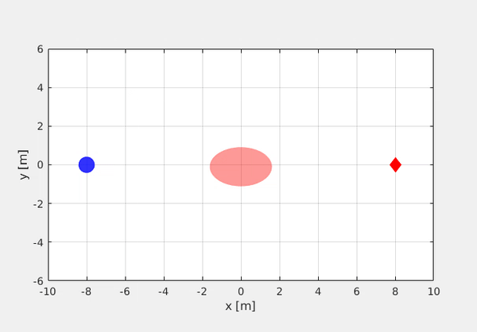

# solver_test
Examples to test different optimization solvers.



```cmd
$ git clone https://github.com/hai-zhu/solver_test.git
$ cd solver_test
$ git submodule update --recursive --init
$ cd external/acados
$ mkdir -p build
$ cd build 
$ cmake -DACADOS_WITH_QPOASES=ON ..
$ make install -j4
```

## Testing environment
* Ubuntu 18.04
* MATLAB R2019b
* Python 3.8
* Casadi 3.5.1

A valid licence is required if you want to test the Forces Pro solver.

[Acados](https://docs.acados.org/index.html) needs to be installed if you want test with it.

## MATLAB test
* Open a MATLAB instance and navigate the code folder.
* Run the "setPath.m" script to add path to MATLAB.
* Run the following script to test different solvers:
    * yalmip_example.m
    * forces_pro_example.m
    * casadi_opti_example.m
    * casadi_shooting_example.m
    * casadi_collocation_example.m

### MATLAB ACADOS test
If you want to test the acados solver with MATLAB, first navigate to the directory './matlab_impl/mpc/acados/'. From the folder, open a terminal and run 'source env_set.sh'. Next open MATLAB from the terminal via the command 'matlab'. Then you can run the 'acados_example.m' script to test the acados solver. 

### Python acados test
* Open a terminal and navigate to the repo directory.
```cmd
$ cd acados_jackal_example/
$ virtualenv .env
$ source .env/bin/activate
$ pip3 install -e ../external/acados/interfaces/acados_template/
$ source env_set.sh
$ python jackal_mpc_example.py
``` 

If you find this code useful in your research then please cite:
```
@article{Zhu2019RAL,
    title = {{Chance-Constrained Collision Avoidance for MAVs in Dynamic Environments}},
    author = {Zhu, Hai and Alonso-Mora, Javier},
    journal = {IEEE Robotics and Automation Letters},
    number = {2},
    volume = {4},
    pages = {776--783},
    publisher = {IEEE},
    year = {2019}
}
```
```
@inproceedings{Zhu2020ICRA,
    title = {{Robust Vision-based Obstacle Avoidance for Micro Aerial Vehicles in Dynamic Environments}},
    author = {Lin, Jiahao and Zhu, Hai and Alonso-Mora, Javier},
    booktitle = {2020 IEEE International Conference on Robotics and Automation (ICRA)},
    pages = {2682--2688},
    publisher = {IEEE},
    year = {2020}
}
```
